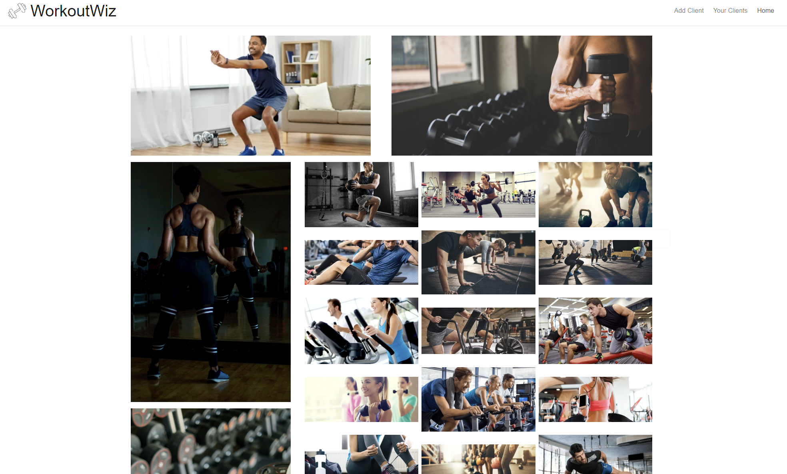
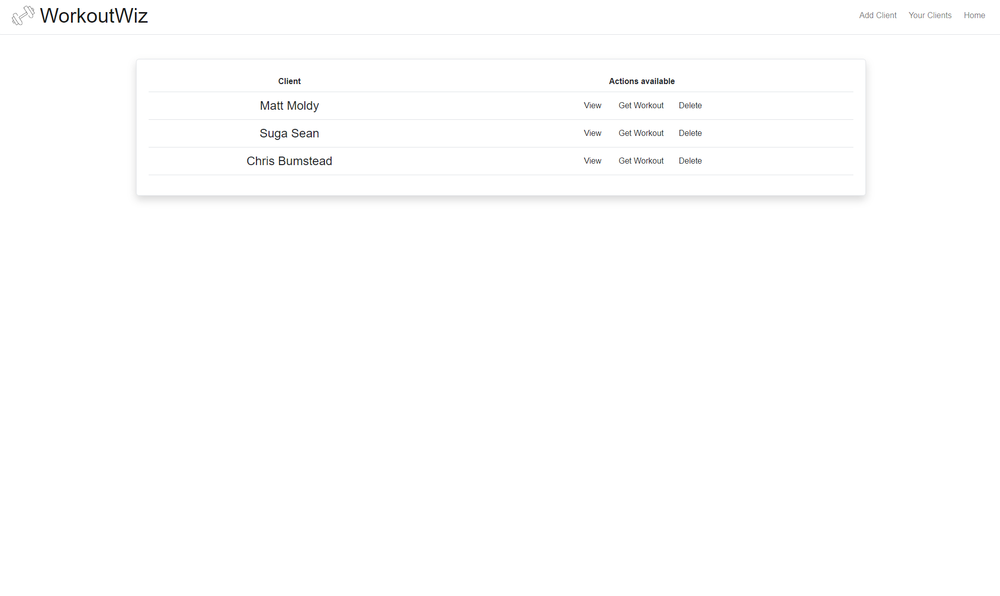
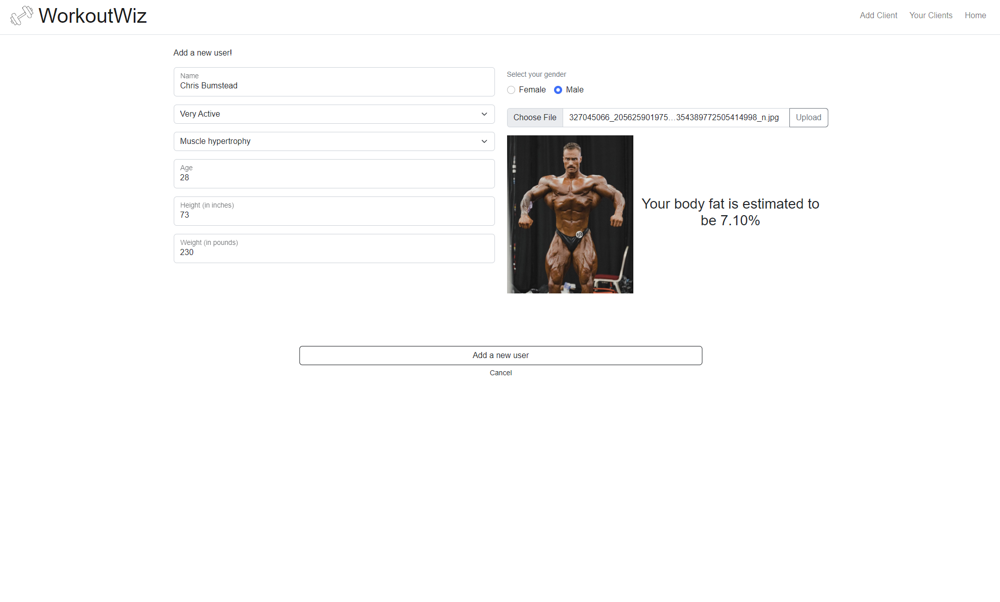
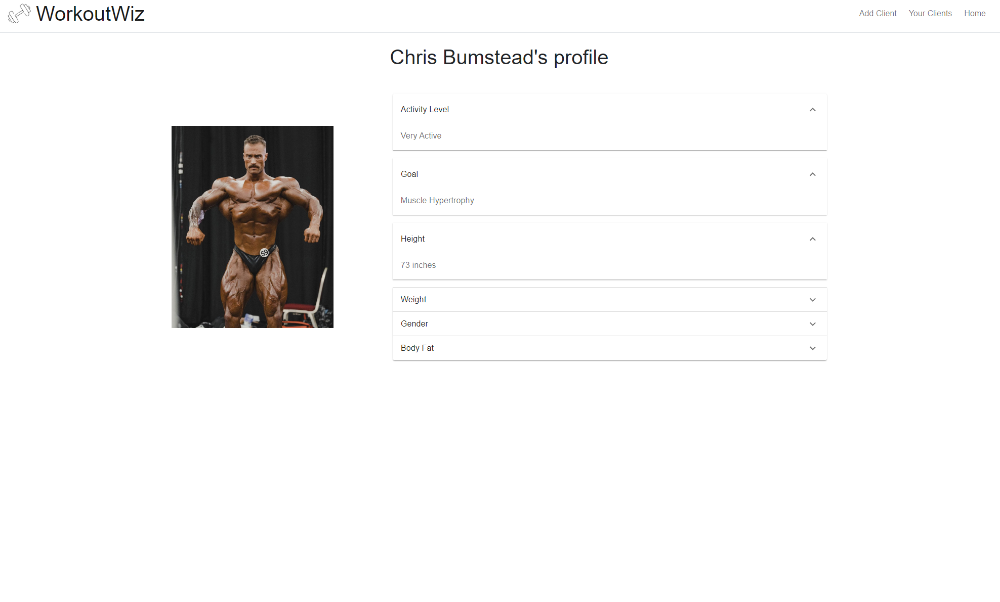
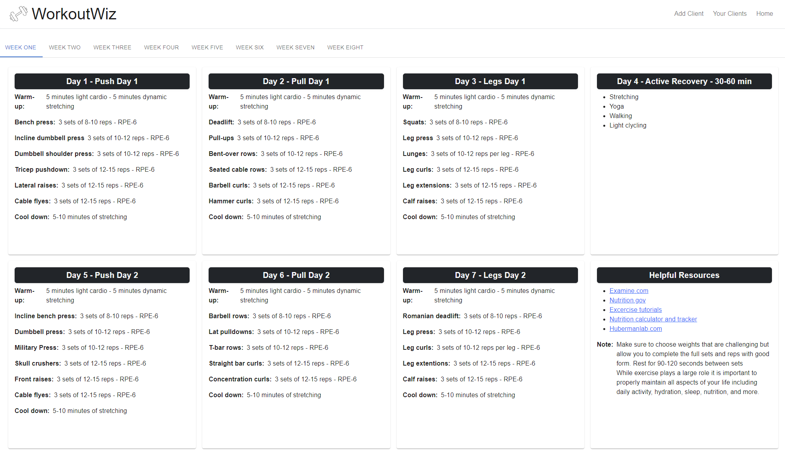

# WorkoutWiz

WorkoutWiz is a full-stack web application that utilizes JavaScript and React to deliver fitness coaches a convienent and ease of use client management system

## About

WorkoutWiz was developed using JavaScript, React, FitImageAPI, ShutterStock API, Node.Js, Express, MongoDB, Material UI, and Bootstrap. This project was created as a collaborative effort between Matthew Moldovan and Victoria Smuk. By taking in data such as name, age, weight, height, gender, activity level, goal, and a physique photo of the client, we are able to provide fitness coaches with a sleek and easy to use tool to readily manage their clients and build workout regimens that are condusive to their goals. As co-developers of WorkoutWiz we exercised proper use of Agile methodologies which allowed us to deliever a high-quality product that met the needs of our users by following a Scrum framework, with regular sprint planning meetings, daily stand-up meetings, and sprint reviews.

## Technologies Used

- JavaScript
- React
- FitImageAPI
- ShutterStock API
- Node.Js
- Express
- MongoDB
- Material UI
- Bootstrap
- HTML
- CSS

## Key Features

- Implementation of FitImageAPI allowing users to quickly and accurately calculate the body fat percentage of a client without the need of an InBody or other physical body fat test
- Designed a responsive front-end with HTML, CSS, Bootstrap, and Material UI to deliever an enhanced user experience

## Source Code

Github Repository: https://github.com/MatthewJMoldovan/WorkoutWiz

## Skills Highlight

- Web Devlopment
- Programming
- JavaScript
- React
- Material UI
- Bootstrap
- APIs
- Agile Methodologies

## Running This Project

1. clone it
2. open the cloned project folder in a terminal or open VSCode to the project and open the integrated terminal
3. npm i to install top-level project devDependencies
4. cd client
5. npm i to install client app dependencies
6. open another terminal and cd api
7. npm i to install api app dependencies
8. cd back to the root of the project
9. npm run api:start in one terminal
10. npm run client:start in another terminal

## Tour of the Application

1. Home Page

2. All Clients Page

3. Add Client Page

4. View Client Page

5. View Workout Page

For more detailed instructions and additional information, please refer to the project's GitHub repository.
